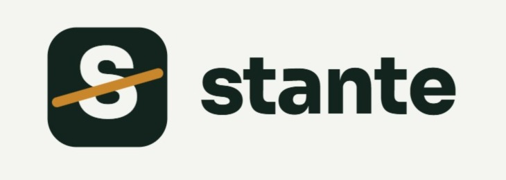
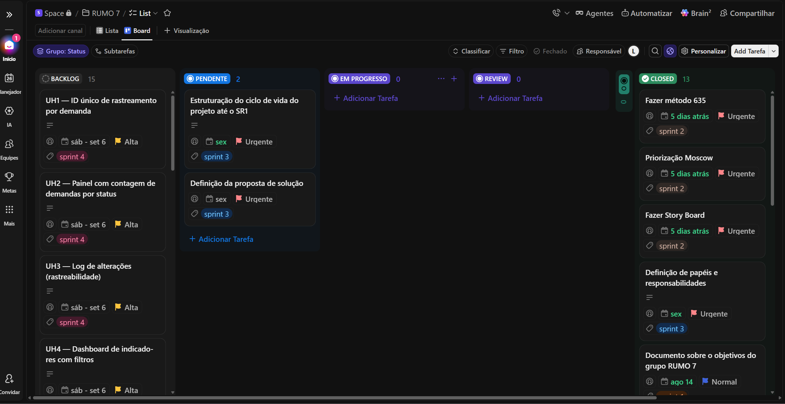
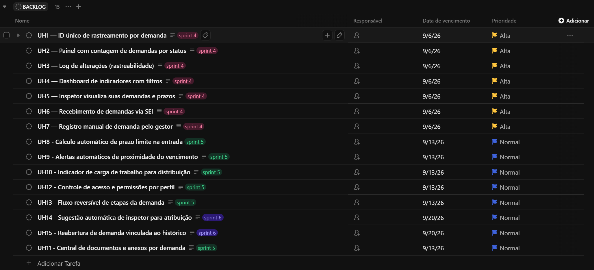

<p align="center">
  
</p>

<h1 align="center">Stante</h1>

<p align="center">
  Gestão centralizada de demandas de Vigilância em Saúde do Trabalhador (VISAT/CEREST)
</p>

<p align="center">
  
  
  
</p>

<p align="center">
  <a href="https://sharing.clickup.com/90171494885/b/h/5-901710774440-2/e2df639a3523910">
    
  </a>
</p>

---

## 📝 Índice

- [Sobre o projeto](#sobre)
- [Como começar](#comecando)
- [Backlog priorizado](#backlog)
- [Metodologia](#metodologia)
- [Construído com](#construido-com)
- [Evidências](#evidencias)
- [Critérios atendidos](#criterios)
- [Como contribuir](#contribuir)
- [Hall of Fame — Equipe](#hall-of-fame)
- [Agradecimentos](#agradecimentos)
- [Licença](#licenca)

<br/>

<a name="sobre"></a>
## 🧐 Sobre o projeto

O **Stante** é um sistema de gestão de demandas desenvolvido para a **VISAT/CEREST Recife** (Vigilância em Saúde do Trabalhador). Hoje, o fluxo de trabalho da equipe depende de planilhas e processos manuais para receber, distribuir, executar e responder formalmente a solicitações de órgãos como **MPT**, **TRT**, **Conselhos de Saúde** e **Sindicatos**.

Essa fragmentação gera:

- 🔴 Perda ou atraso no cumprimento de prazos legais
- 🔴 Falta de visibilidade sobre a carga de trabalho dos inspetores em campo
- 🔴 Dificuldade de rastrear o histórico de cada demanda
- 🔴 Ausência de retorno formal e padronizado aos órgãos demandantes

O Stante centraliza esse ciclo — do recebimento da demanda até o fechamento — dando **rastreabilidade, prazos visíveis e indicadores em tempo real** para quem gerencia, quem executa em campo e quem cobra uma resposta institucional.

> Projeto construído a partir de pesquisa documental, definição de proto-personas, matriz CSD, roteiro de entrevista semiestruturada e mapeamento de stakeholders.

<br/>

<a name="comecando"></a>
## 🏁 Como começar

Estas instruções vão te orientar a acompanhar ou contribuir com o projeto.

### Pré-requisitos

O projeto está na fase de descoberta e construção de backlog — ainda não há uma aplicação instalável. Para acompanhar ou contribuir, você precisa de:

```
Acesso ao Space "RUMO 7" no ClickUp (solicite a um PM da equipe)
Git instalado, para quando o versionamento de código começar
```

### Acessando o projeto

Acesse o board completo com todas as tarefas e status:

**[📋 Abrir Board no ClickUp »](https://sharing.clickup.com/90171494885/b/h/5-901710774440-2/e2df639a3523910)**

Quando o código-fonte for versionado neste repositório:

```bash
git clone <url-do-repositorio>
cd stante
```

<br/>

<a name="backlog"></a>
## 🗂️ Backlog priorizado

15 histórias de usuário, no padrão **3Cs** (Card, Conversation, Confirmation), organizadas no board por status (Backlog → Pendente → Em progresso → Review → Closed).

| # | História de Usuário | Acessar |
|---|---|---|
| UH1 | ID único de rastreamento por demanda | [](https://sharing.clickup.com/90171494885/t/h/86e2zwpnq/TEVGXRVSX1Z0UCL) |
| UH2 | Painel com contagem de demandas por status | [](https://sharing.clickup.com/90171494885/t/h/86e2zwt9e/LW6H9ZL78Z8HUDE) |
| UH3 | Log de alterações (rastreabilidade) | [](https://sharing.clickup.com/90171494885/t/h/86e2zwu2k/HX8FUBPD5TZ7J3W) |
| UH4 | Dashboard de indicadores com filtros | [](https://sharing.clickup.com/90171494885/t/h/86e2zwuf2/H4Z1MQ59PC71DPX) |
| UH5 | Inspetor visualiza suas demandas e prazos | [](https://sharing.clickup.com/90171494885/t/h/86e2zwuya/DDAG9LLHH8HQRUG) |
| UH6 | Recebimento de demandas via SEI | [](https://sharing.clickup.com/90171494885/t/h/86e2zwve0/M7GI6XM06WIWCF6) |
| UH7 | Registro manual de demanda pelo gestor | [](https://sharing.clickup.com/90171494885/t/h/86e2zww9r/8WNZ0CDT2BIU2KH) |
| UH8 | Cálculo automático de prazo limite na entrada | [](https://sharing.clickup.com/90171494885/t/h/86e2zwx7k/07O24YECIB2IB9K) |
| UH9 | Alertas automáticos de proximidade do vencimento | [](https://sharing.clickup.com/90171494885/t/h/86e2zx0bv/EFTB3O3R5X3YIZF) |
| UH10 | Indicador de carga de trabalho para distribuição | [](https://sharing.clickup.com/90171494885/t/h/86e2zx12y/4F06LLYQ9E9COGR) |
| UH11 | Central de documentos e anexos por demanda | [](https://sharing.clickup.com/90171494885/t/h/86e2zx261/16EJYW5UEKI3FWY) |
| UH12 | Controle de acesso e permissões por perfil | [](https://sharing.clickup.com/90171494885/t/h/86e2zx2kv/PEPXM70PQM7NO3H) |
| UH13 | Fluxo reversível de etapas da demanda | [](https://sharing.clickup.com/90171494885/t/h/86e2zx3j6/894KFFYP30Z29AP) |
| UH14 | Sugestão automática de inspetor para atribuição | [](https://sharing.clickup.com/90171494885/t/h/86e2zx4d4/G7GNZB7HDHPAMRH) |
| UH15 | Reabertura de demanda vinculada ao histórico | [](https://sharing.clickup.com/90171494885/t/h/86e2zx50v/0RICF5ILXO4O8TX) |

<br/>

<a name="metodologia"></a>
## 🔬 Metodologia

O processo de descoberta seguiu o fluxo: **Pesquisa documental → Persona preliminar → Entrevista → Validação → Persona final**, apoiado em:

- **Proto-personas** — Gestora VISAT, Inspetor de campo e Representante institucional
- **Matriz CSD** — Certezas, Suposições e Dúvidas sobre o problema
- **Mapeamento de stakeholders** — centrais, internos e externos
- **Roteiro de entrevista semiestruturada** — validação de hipóteses de dor com a equipe real
- **Jornada do usuário** — storyboard das três personas, ponta a ponta
- **Análise de dados públicos (SmartLab/Previdência Social)** — fundamentação do problema de subnotificação
- **Scrumban** — gestão do backlog e das sprints da equipe no ClickUp

<br/>

<a name="construido-com"></a>
## ⛏️ Construído com

A stack de desenvolvimento do produto ainda está em definição conforme o projeto avança. As ferramentas abaixo já sustentam a construção do backlog e da documentação:

- [ClickUp](https://clickup.com) — board, backlog e sprints
- [Markdown](https://www.markdownguide.org) — documentação
- [Shields.io](https://shields.io) — badges
- GitHub — avatares reais da equipe no Hall of Fame

<br/>

<a name="evidencias"></a>
## 📸 Evidências

**Board — visão geral**


**Backlog priorizado**


<br/>

<a name="criterios"></a>
## ✅ Critérios atendidos — Entrega 01

| Critério | Status |
|---|---|
| Mínimo de 15 histórias de usuário, padrão 3Cs | ✅ 15 histórias (UH1–UH15) |
| Backlog priorizado no board | ✅ ClickUp — colunas Backlog / Pendente / Em progresso / Review / Closed |
| Repositório público com README organizado | ✅ este documento |
| Papéis de cada integrante registrados | ✅ seção Hall of Fame |
| Print atualizado do board no README | ✅ seção Evidências |
| Print atualizado do backlog no README | ✅ seção Evidências |

<br/>

<a name="contribuir"></a>
## 🎈 Como contribuir

1. Crie uma branch a partir de `main` referenciando a tarefa do ClickUp:
   ```bash
   git checkout -b feature/UHx-nome-da-tarefa
   ```
2. Faça commits seguindo o padrão [Conventional Commits](https://www.conventionalcommits.org):
   ```
   feat: adiciona cálculo automático de prazo
   fix: corrige exibição de status no painel
   docs: atualiza README
   ```
3. Abra um Pull Request vinculando a tarefa correspondente no ClickUp.
4. Peça revisão de pelo menos 1 dev do time antes do merge em `main`.

<br/>

<a name="hall-of-fame"></a>
## ✨ Hall of Fame — Equipe RUMO 7

<table>
<tr>
<td align="center">
<a href="https://github.com/lopesyas"></a><br/>
<b><a href="https://github.com/lopesyas">Yasmin Lopes</a></b><br/><sub>Product Manager</sub>
</td>
<td align="center">
<a href="https://github.com/lucas-calixto-lemos"></a><br/>
<b><a href="https://github.com/lucas-calixto-lemos">Lucas Calixto</a></b><br/><sub>Product Manager</sub>
</td>
<td align="center">
<a href="https://github.com/juuvmed"></a><br/>
<b><a href="https://github.com/juuvmed">Jullya Medeiros</a></b><br/><sub>Data Analyst</sub>
</td>
<td align="center">
<a href="https://github.com/marcos-felipe17"></a><br/>
<b><a href="https://github.com/marcos-felipe17">Marcos Felipe</a></b><br/><sub>Data Engineer</sub>
</td>
</tr>
<tr>
<td align="center">
<a href="https://github.com/O-bono"></a><br/>
<b><a href="https://github.com/O-bono">Miguel Cabral</a></b><br/><sub>Front-end Developer</sub>
</td>
<td align="center">
<a href="https://github.com/itsjvsouza"></a><br/>
<b><a href="https://github.com/itsjvsouza">João Noya</a></b><br/><sub>Back-end Developer</sub>
</td>
<td align="center">
<a href="https://github.com/leandrodev-sudo"></a><br/>
<b><a href="https://github.com/leandrodev-sudo">Leandro Carvalho</a></b><br/><sub>Back-end Developer</sub>
</td>
<td></td>
</tr>
</table>
<a name="licenca"></a>
## 📄 Licença

Projeto acadêmico desenvolvido para a CESAR School. Uso restrito à equipe RUMO 7 — sem licença open-source definida até o momento.

<br/>

<div align="center">

time **RUMO 7** — CESAR School

</div>
